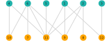
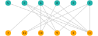
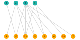
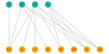

# BipartiteLayout.jl
A lightweight package to visualize (small) bipartite graphs using optimal layout built on [JuMP.jl](http://www.juliaopt.org/JuMP.jl/v0.15/), [GraphPlot.jl](https://github.com/JuliaGraphs/GraphPlot.jl) and [LightGraphs.jl](https://github.com/JuliaGraphs/LightGraphs.jl).

# Usage

Import everything needed

```julia
using BipartiteLayout
using LightGraphs, GraphPlot
using JuMP
using GLPK
using Distributions
using Cairo, Compose, Fontconfig
```

Generate (or load) your graph

```julia
function generate_bipartite_graph(; na=5, nb=5, p=0.1)
    d = Geometric(p)
    g = SimpleGraph()
    for _ in 1:(na+nb)
        add_vertex!(g)
    end
    ns = min.(nb, rand(d, na))
    for (a,n) in enumerate(ns)
        for b in sample(1:nb, n)
            add_edge!(g, a, na+b)
        end
    end
    g
end

g = generate_bipartite_graph()
```

Define an optimizer (GLPK in this case), optimize layout and save the result

```julia
opt = with_optimizer(GLPK.Optimizer)
vis = BipartiteLayout.bipartite_layout(g, opt)
draw(SVG("res/g.svg", 16cm, max(na, nb)*1cm), vis)
```

# Examples

### Optimized

### Random


### Optimized

### Random


### Optimized

### Random

